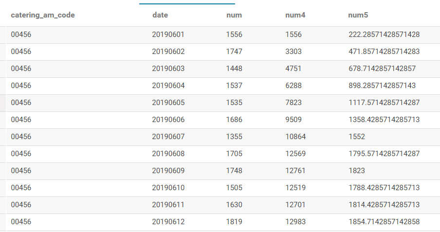

- [1、Hive避免使用MR的情况](#1hive避免使用mr的情况)
- [2、Hive控制map个数和reduce个数](#2hive控制map个数和reduce个数)
  * [2.1、控制hive任务中的map数](#21控制hive任务中的map数)
  * [2.2、控制hive任务的reduce数](#22控制hive任务的reduce数)
- [3、Join](#3join)
  * [3.1、inner join](#31inner-join)
  * [3.2、left outer join](#32left-outer-join)
  * [3.3、right outer join](#33right-outer-join)
  * [3.4、full outer join](#34full-outer-join)
  * [3.5、left semi-join](#35left-semi-join)
  * [3.6、cross join（笛卡儿积）](#36cross-join-笛卡儿积-)
  * [3.7、map-side join](#37map-side-join)
- [4、调优](#4调优)
  * [4.1、使用explain](#41使用explain)
  * [4.2、explain extended](#42explain-extended)
  * [4.3、限制调整](#43限制调整)
  * [4.4、JOIN优化](#44join优化)
  * [4.5、本地模式](#45本地模式)
  * [4.6、并行执行](#46并行执行)
  * [4.7、严格模式](#47严格模式)
  * [4.8、调整mapper个数和reducer个数](#48调整mapper个数和reducer个数)
    + [4.8.1、控制hive任务中的map数](#481控制hive任务中的map数)
    + [4.8.2、控制hive任务的reduce数](#482控制hive任务的reduce数)
  * [4.9、JVM重用](#49jvm重用)
  * [4.10、索引](#410索引)
  * [4.11、动态分区调整](#411动态分区调整)
  * [4.12、推测执行](#412推测执行)
  * [4.13、单个MR中多个GROUP BY](#413单个mr中多个group-by)
  * [4.14、数据倾斜、任务长尾](#414数据倾斜任务长尾)
- [5、窗口函数](#5窗口函数)
  * [5.1、sum,avg,min,max](#51sumavgminmax)
  * [5.2、ntile,row_number,rank,dense_rank](#52ntilerownumberrankdenserank)
- [6、数据类型](#6数据类型)
- [7、hiveconf参数](#7hiveconf参数)
- [8、正则表达式](#8正则表达式)
- [9、CTAS问题](#9ctas问题)
- [10、update、delete问题](#10updatedelete问题)

<small><i><a href='http://ecotrust-canada.github.io/markdown-toc/'>Table of contents generated with markdown-toc</a></i></small>

1、Hive避免使用MR的情况
=======================

在Hive中的查询，大多数情况下都会被解析成MapReduce的job进行计算。Hive中有些情况是不会触发MapReduce的，即所谓的--Local
mode本地模式。

以下三种方式都不会触发MapReduce

1、select \* from

(select 'limx' as name,'man' as gender,18 as age) t1;

或者

select \* from t1 where pt='20190101';（限制分区）

这种情况下，Hive会读取mytable1对应的存储目录下的文件。

2、select \* from mytable1 limit 10;

3、手动启用本地模式：

set hive.exec.mode.local.auto=true;

2、Hive控制map个数和reduce个数
==============================

2.1、控制hive任务中的map数
--------------------------

通常情况下，作业会通过input的目录产生一个或者多个map任务。

主要的决定因素有：
input的文件总个数，input的文件大小，集群设置的文件块大小(目前为128M,
可在hive中通过set dfs.block.size命令查看到，该参数不能自定义修改)；

举例：

1.  假设input目录下有1个文件a,大小为780M,那么hadoop会将该文件a分隔成7个块（6个128m的块和1个12m的块），从而产生7个map数。

2.  假设input目录下有3个文件a,b,c,大小分别为10m，20m，130m，那么hadoop会分隔成4个块（10m,20m,128m,2m），从而产生4个map数，即如果文件大于块大小(128m)，那么会拆分，如果小于块大小，则把该文件当成一个块。

3.  map数是不是越多越好？不是，如果一个任务有很多小文件（远远小于块大小128m），则每个小文件也会被当做一个块，用一个map任务来完成，而一个map任务启动和初始化的时间远远大于逻辑处理的时间，就会造成很大的资源浪费。而且，同时可执行的map数是受限的。

4.  是不是一定要保证每个map处理接近128m的文件块？答案也是不一定。比如有一个127m的文件，正常会用一个map去完成，但这个文件只有一个或者两个小字段，却有几千万的记录，如果map处理的逻辑比较复杂，用一个map任务去做，肯定也比较耗时。

针对上面的问题3和4，我们需要采取两种方式来解决：减少map数和增加map数。

如何合并小文件，减少map数？

假设一个SQL任务：

Select count(1) from t1 where pt = ‘2019-01-01’;

该任务的目录下共有194个文件，其中很多是远远小于128m的小文件，总大小9G，正常执行会用194个map任务。

Map总共消耗的计算资源： SLOTS_MILLIS_MAPS= 623,020。

通过以下方法来在map执行前合并小文件，减少map数：

set mapred.max.split.size=100000000;

set mapred.min.split.size.per.node=100000000;

set mapred.min.split.size.per.rack=100000000;

set hive.input.format=org.apache.hadoop.hive.ql.io.CombineHiveInputFormat;

再执行上面的语句，用了74个map任务，map消耗的计算资源：SLOTS_MILLIS_MAPS=
333,500。

对于这个简单SQL任务，执行时间上可能差不多，但节省了一半的计算资源。

大概解释一下，100000000表示100M, set
hive.input.format=org.apache.hadoop.hive.ql.io.CombineHiveInputFormat;这个参数表示执行前进行小文件合并，前面三个参数确定合并文件块的大小，大于文件块大小128m的，按照128m来分隔，小于128m,大于100m的，按照100m来分隔，把那些小于100m的（包括小文件和分割大文件剩下的）进行合并，最终生成了74个块。

如何适当的增加map数？

当input的文件都很大，任务逻辑复杂，map执行非常慢的时候，可以考虑增加Map数，来使得每个map处理的数据量减少，从而提高任务的执行效率。

假设有这样一个任务：

Select data_desc,

count(1),

count(distinct id),

sum(case when …),

sum(case when …),

sum(…)

from a group by data_desc

如果表a只有一个文件，大小为120M，但包含几千万的记录，如果用1个map去完成这个任务，肯定是比较耗时的，这种情况下，我们要考虑将这一个文件合理的拆分成多个，这样就可以用多个map任务去完成。

set mapred.reduce.tasks=10;

create table a_1 as

select \* from a

distribute by rand(123);

这样会将a表的记录，随机的分散到包含10个文件的a_1表中，再用a_1代替上面sql中的a表，则会用10个map任务去完成。每个map任务处理大于12M（几百万记录）的数据，效率肯定会好很多。

看上去，貌似这两种有些矛盾，一个是要合并小文件，一个是要把大文件拆成小文件，这点正是重点需要关注的地方，根据实际情况，控制map数量需要遵循两个原则：使大数据量利用合适的map数；使单个map任务处理合适的数据量。

2.2、控制hive任务的reduce数
---------------------------

Hive自己如何确定reduce数：

reduce个数的设定极大影响任务执行效率，不指定reduce个数的情况下，Hive会猜测确定一个reduce个数，基于以下两个设定：

hive.exec.reducers.bytes.per.reducer（每个reduce任务处理的数据量，默认为1000\^3=1G）

hive.exec.reducers.max（每个任务最大的reduce数，默认为999）

计算reducer数的公式很简单**N=min(参数2，总输入数据量/参数1)**

即如果reduce的输入（map的输出）总大小不超过1G,那么只会有一个reduce任务；

如：select pt,count(1) from popt_tbaccountcopy_mes where pt = ‘2012-07-04’ group
by pt;

/group/p_sdo_data/p_sdo_data_etl/pt/popt_tbaccountcopy_mes/pt=2012-07-04
总大小为9G多，因此这句有10个reduce

调整reduce个数方法一：

调整hive.exec.reducers.bytes.per.reducer参数的值；

set hive.exec.reducers.bytes.per.reducer=500000000; （500M）

select pt,count(1) from popt_tbaccountcopy_mes where pt = ‘2012-07-04’ group by
pt; 这次有20个reduce

调整reduce个数方法二；

set mapred.reduce.tasks = 15;

select pt,count(1) from popt_tbaccountcopy_mes where pt = ‘2012-07-04’ group by
pt;这次有15个reduce

reduce个数并不是越多越好；

同map一样，启动和初始化reduce也会消耗时间和资源；

另外，有多少个reduce,就会有多少个输出文件，如果生成了很多个小文件，那么如果这些小文件作为下一个任务的输入，则也会出现小文件过多的问题；

什么情况下只有一个reduce？

很多时候你会发现任务中不管数据量多大，不管你有没有设置调整reduce个数的参数，任务中一直都只有一个reduce任务；其实只有一个reduce任务的情况，除了数据量小于hive.exec.reducers.bytes.per.reducer参数值的情况外，还有以下原因：

1.  没有group by的汇总，比如把select pt,count(1) from popt_tbaccountcopy_mes
    where pt = '2012-07-04' group by pt; 写成 select count(1) from
    popt_tbaccountcopy_mes where pt = '2012-07-04';

这点非常常见，希望大家尽量改写。

1.  用了Order by

2.  有笛卡尔积

因为这些操作都是全局的，所以hadoop不得不用一个reduce去完成；

同样的，在设置reduce个数的时候也需要考虑这两个原则：使大数据量利用合适的reduce数；使单个reduce任务处理合适的数据量。

3、Join
=======

3.1、inner join
---------------

3.2、left outer join
--------------------

3.3、right outer join
---------------------

3.4、full outer join
--------------------

3.5、left semi-join
-------------------

Hive**不支持多条件**in/exists子查询的语义，但是**支持单条件**in/exists子查询。

支持：select a.key,a.value from a where a.key in (select b.key from b);

不支持：select a.key,a.value from a where a.key,a.value in (select b.key,b.value
from b);

left semi-join单条件、多条件均支持，而且可以高效实现。

select a.key, a.val from a left semi join b on (a.key = b.key)

3.6、cross join（笛卡儿积）
---------------------------

3.7、map-side join
------------------

mapjoin会把小表全部读入内存中，在map阶段直接拿另外一个表的数据和内存中表的数据做匹配，而普通的equality
join则是类似于mapreduce中的filejoin,需要先分组，然后在reduce端进行连接，由于**mapjoin是在map是进行了join操作**，省去了reduce的运行，效率也会高很多

mapjoin还有一个很大的好处是能够进行不等连接的join操作，如果将不等条件写在where中，那么mapreduce过程中会进行笛卡尔积，运行效率特别低，这是由于equality
join （不等值join操作有 \>、\<、like等如：a.x \< b.y 或者 a.x like b.y）
需要在reduce端进行不等值判断，map端只能过滤掉where中等值连接时候的条件，如果使用mapjoin操作，在map的过程中就完成了不等值的join操作，效率会高很多。

例子：t1为小表

select /\*+ mapjoin(t1)\*/ t1.id,t1.name,t2.age from table t1 join table2 t2 on
(t1.id=t2.id)

4、调优
=======

1、好的模型设计事半功倍

2、解决数据倾斜问题，set hive.groupby.skewindata=true;

3、减少job数

4、设置合理的map reduce的task数，能有效提升性能

5、对count(distinct)采取漠视的方法，尤其数据大的时候很容易产生倾斜问题

6、小文件合并

7、把握整体，单个作业的最优不如整体的最优

| 设置                                                                      | 意义               |
|---------------------------------------------------------------------------|--------------------|
| hive.auto.convert.join=true                                               | 自动转换mapjoin    |
| hive.auto.convert.join.noconditionaltask = true                           | 无条件转换         |
| hive.auto.convert.join.noconditionaltask.size = 250000000                 | 有条件转换         |
| set hive.exec.mode.local.auto=true                                        | 开启本地模式       |
| set hive.smalltable.filesize=250000000L                                   | 设置小表的大小     |
| set hive.map.aggr=true                                                    | map阶段自动聚合    |
| set hive.merge.mapredfiles=true                                           |                    |
| set hive.merge.mapfiles=true                                              |                    |
| set hive.merge.size.per.task=256000000                                    |                    |
| set hive.merge.smallfiles.avgsize=16000000                                |                    |
| set mapred.output.compression.type=BLOCK                                  | 输出压缩方式       |
| set hive.exec.compress.output=true                                        | 输出压缩           |
| set hive.input.format=org.apache.hadoop.hive.ql.io.CombineHiveInputFormat | 合并输入           |
| set mapred.max.split.size=100000000                                       |                    |
| set mapred.min.split.size.per.node=100000000                              |                    |
| set mapred.min.split.size.per.rack=100000000                              |                    |
| mapred.reduce.tasks                                                       | 设置reduce个数     |
| hive.exec.reducers.max                                                    | 设置最大reduce个数 |

设置样例：

HIVE="/usr/local/complat/cdh5.10.0/hive/bin/hive

\-hiveconf mapreduce.job.name=xxstat_hive \# 设置作业名

\-hiveconf mapred.job.queue.name=root.shoulei \# 设置作业队列名

\# 输入输出

\-hiveconf hive.exec.compress.output=true

\-hiveconf hive.exec.compress.intermediate=true

\-hiveconf io.seqfile.compression.type=BLOCK

\-hiveconf hive.input.format=org.apache.hadoop.hive.ql.io.CombineHiveInputFormat

\-hiveconf
mapreduce.output.compression.codec=org.apache.hadoop.io.compress.GzipCodec

\-hiveconf hive.map.aggr=true

\-hiveconf hive.stats.autogather=false

\# 动态分区

\-hiveconf hive.exec.dynamic.partition=true

\-hiveconf hive.exec.dynamic.partition.mode=nonstrict

\# 小文件合并

\-hiveconf mapreduce.max.split.size=100000000

\-hiveconf mapreduce.min.split.size.per.node=100000000

\-hiveconf mapreduce.min.split.size.per.rack=100000000

\# join配置

\-hiveconf hive.auto.convert.join=false

​

\# 数据倾斜处理

\-hiveconf hive.groupby.skewindata=false

\#设置reduce的个数

set mapred.reduce.tasks=18;

\# 设置最大reduce的个数

set hive.exec.reducers.max=128;

\#开启本地模式

set hive.exec.mode.local.auto=true;(默认为false)

\#当一个job满足如下条件才能真正使用本地模式：

1.job的输入数据大小必须小于参数：hive.exec.mode.local.auto.inputbytes.max(默认128MB)

2.job的map数必须小于参数：hive.exec.mode.local.auto.tasks.max(默认4)

3.job的reduce数必须为0或者1

4.1、使用explain
----------------

4.2、explain extended
---------------------

4.3、限制调整
-------------

4.4、JOIN优化
-------------

4.5、本地模式
-------------

4.6、并行执行
-------------

4.7、严格模式
-------------

4.8、调整mapper个数和reducer个数
--------------------------------

### 4.8.1、控制hive任务中的map数

通常情况下，作业会通过input的目录产生一个或者多个map任务。

主要的决定因素有：
input的文件总个数，input的文件大小，集群设置的文件块大小(目前为128M,
可在hive中通过set dfs.block.size命令查看到，该参数不能自定义修改)；

举例：

1.  假设input目录下有1个文件a,大小为780M,那么hadoop会将该文件a分隔成7个块（6个128m的块和1个12m的块），从而产生7个map数。

2.  假设input目录下有3个文件a,b,c,大小分别为10m，20m，130m，那么hadoop会分隔成4个块（10m,20m,128m,2m），从而产生4个map数，即如果文件大于块大小(128m)，那么会拆分，如果小于块大小，则把该文件当成一个块。

3.  map数是不是越多越好？不是，如果一个任务有很多小文件（远远小于块大小128m），则每个小文件也会被当做一个块，用一个map任务来完成，而一个map任务启动和初始化的时间远远大于逻辑处理的时间，就会造成很大的资源浪费。而且，同时可执行的map数是受限的。

4.  是不是一定要保证每个map处理接近128m的文件块？答案也是不一定。比如有一个127m的文件，正常会用一个map去完成，但这个文件只有一个或者两个小字段，却有几千万的记录，如果map处理的逻辑比较复杂，用一个map任务去做，肯定也比较耗时。

针对上面的问题3和4，我们需要采取两种方式来解决：减少map数和增加map数。

**如何合并小文件，减少map数？**

假设一个SQL任务：

Select count(1) from t1 where pt = ‘2019-01-01’;

该任务的目录下共有194个文件，其中很多是远远小于128m的小文件，总大小9G，正常执行会用194个map任务。

Map总共消耗的计算资源： SLOTS_MILLIS_MAPS= 623,020。

通过以下方法来在map执行前合并小文件，减少map数：

set mapred.max.split.size=100000000;

set mapred.min.split.size.per.node=100000000;

set mapred.min.split.size.per.rack=100000000;

set hive.input.format=org.apache.hadoop.hive.ql.io.CombineHiveInputFormat;

再执行上面的语句，用了74个map任务，map消耗的计算资源：SLOTS_MILLIS_MAPS=
333,500。

对于这个简单SQL任务，执行时间上可能差不多，但节省了一半的计算资源。

大概解释一下，100000000表示100M, set
hive.input.format=org.apache.hadoop.hive.ql.io.CombineHiveInputFormat;这个参数表示执行前进行小文件合并，前面三个参数确定合并文件块的大小，大于文件块大小128m的，按照128m来分隔，小于128m,大于100m的，按照100m来分隔，把那些小于100m的（包括小文件和分割大文件剩下的）进行合并，最终生成了74个块。

**如何适当的增加map数？**

当input的文件都很大，任务逻辑复杂，map执行非常慢的时候，可以考虑增加Map数，来使得每个map处理的数据量减少，从而提高任务的执行效率。

假设有这样一个任务：

Select data_desc,

count(1),

count(distinct id),

sum(case when …),

sum(case when …),

sum(…)

from a group by data_desc

如果表a只有一个文件，大小为120M，但包含几千万的记录，如果用1个map去完成这个任务，肯定是比较耗时的，这种情况下，我们要考虑将这一个文件合理的拆分成多个，这样就可以用多个map任务去完成。

set mapred.reduce.tasks=10;

create table a_1 as

select \* from a

distribute by rand(123);

这样会将a表的记录，随机的分散到包含10个文件的a_1表中，再用a_1代替上面sql中的a表，则会用10个map任务去完成。每个map任务处理大于12M（几百万记录）的数据，效率肯定会好很多。

这两种看着有些矛盾，一个是要合并小文件，一个是要把大文件拆成小文件，这点正是重点需要关注的地方，根据实际情况，控制map数量需要遵循两个原则：使大数据量利用合适的map数；使单个map任务处理合适的数据量。

### 4.8.2、控制hive任务的reduce数

**Hive自己如何确定reduce数：**

reduce个数的设定极大影响任务执行效率，不指定reduce个数的情况下，Hive会猜测确定一个reduce个数，基于以下两个设定：

hive.exec.reducers.bytes.per.reducer（每个reduce任务处理的数据量，默认为1000\^3=1G）

hive.exec.reducers.max（每个任务最大的reduce数，默认为999）

计算reducer数的公式很简单**N=min(参数2，总输入数据量/参数1)**

即如果reduce的输入（map的输出）总大小不超过1G,那么只会有一个reduce任务；

如：select pt,count(1) from popt_tbaccountcopy_mes where pt = ‘2012-07-04’ group
by pt;

/group/p_sdo_data/p_sdo_data_etl/pt/popt_tbaccountcopy_mes/pt=2012-07-04
总大小为9G多，因此这句有10个reduce

**调整reduce个数方法一：**

调整hive.exec.reducers.bytes.per.reducer参数的值；

set hive.exec.reducers.bytes.per.reducer=500000000; （500M）

select pt,count(1) from popt_tbaccountcopy_mes where pt = ‘2012-07-04’ group by
pt; 这次有20个reduce

**调整reduce个数方法二；**

set mapred.reduce.tasks = 15;

select pt,count(1) from popt_tbaccountcopy_mes where pt = ‘2012-07-04’ group by
pt;这次有15个reduce

reduce个数并不是越多越好；

同map一样，启动和初始化reduce也会消耗时间和资源；

另外，有多少个reduce,就会有多少个输出文件，如果生成了很多个小文件，那么如果这些小文件作为下一个任务的输入，则也会出现小文件过多的问题；

**什么情况下只有一个reduce？**

很多时候你会发现任务中不管数据量多大，不管你有没有设置调整reduce个数的参数，任务中一直都只有一个reduce任务；其实只有一个reduce任务的情况，除了数据量小于hive.exec.reducers.bytes.per.reducer参数值的情况外，还有以下原因：

1.没有group by的汇总，比如把select pt,count(1) from popt_tbaccountcopy_mes where
pt = '2012-07-04' group by pt; 写成 select count(1) from popt_tbaccountcopy_mes
where pt = '2012-07-04';这点非常常见，希望大家尽量改写。

2.用了Order by

3.有笛卡尔积

因为这些操作都是全局的，所以hadoop不得不用一个reduce去完成；在设置reduce个数的时候也需要考虑这两个原则：使大数据量利用合适的reduce数；使单个reduce任务处理合适的数据量。

4.9、JVM重用
------------

4.10、索引
----------

4.11、动态分区调整
------------------

4.12、推测执行
--------------

4.13、单个MR中多个GROUP BY
--------------------------

4.14、数据倾斜、任务长尾
------------------------

**join长尾**

SQL在Join执行阶段会将Join
Key相同的数据分发到同一个执行Instance上处理。如果某个Key上的数据量比较多，会导致该Instance执行时间比其他Instance执行时间长。其表现为：执行日志中该Join
Task的大部分Instance都已执行完成，但少数几个Instance一直处于执行中，这种现象称之为长尾

**长尾类别&优化方法**

**小表长尾**

Join倾斜时，如果某路输入比较小，可以采用Mapjoin避免倾斜。Mapjoin的原理是将Join操作提前到Map端执行，这样可以避免因为分发Key不均匀导致数据倾斜。但是Mapjoin的使用有限制，必须是Join中的从表比较小才可用。所谓从表，即Left
Outer Join中的右表，或者Right Outer Join中的左表。

**热点值长尾**

如果是因为热点值导致长尾，并且Join的输入比较大无法用Mapjoin，可以先将热点Key取出，对于主表数据用热点Key切分成热点数据和非热点数据两部分分别处理，最后合并，union
all 热点和非热点的数据。

**空值长尾**

join时，假设左表(left_table)存在大量的空值，空值聚集到一个reduce上。由于left_table
存在大量的记录，无法使用mapjoin 。此时可以使用 coalesce(left_table.key,
rand()\*9999)将key为空的情况下赋予随机值，来避免空值集中造成长尾。

**map长尾**

Map端读取数据时，由于文件大小分布不均匀，一些map任务读取并处理的数据特别多，一些map任务处理的数据特别少，造成map端长尾。这种情形没有特别好的方法，只能调节splitsize来增加mapper数量，让数据分片更小，以期望获得更均匀的分配。

**reduce长尾**

Distinct执行原理：将需要去重的字段以及Group
By字段联合作为key将数据分发到Reduce端。

由于Distinct操作的存在，数据无法在Map端的Shuffle阶段根据Group
By先做一次聚合操作,减少传输的数据量，而是将所有的数据都传输到Reduce端，当Key的数据分发不均匀时，就会导致Reduce端长尾，特别当多个Distinct同时出现在一段SQL代码中时，数据会被分发多次，不仅会造成数据膨胀N倍，也会把长尾现象放大N倍。

**原sql：**

SELECT D1, D2

, COUNT(DISTINCT CASE

WHEN A IS NOT NULL THEN B

END) AS B_distinct_cnt

FROM xxx

GROUP BY D1, D2

**优化：**

create table tmp1

as

select D1,D2,B,

count( case when A is not null then B end ) as B_cnt

from xxx

group by D1, D1, B

select D1,D2,

sum(case when B_cnt \> 0 then 1 else 0 end) as B_distinct_cnt

from tmp1

group by D1,D2

5、窗口函数
===========

5.1、sum,avg,min,max
--------------------

Windows子句： Rows between

Preceding：往前

Following：往后

Current row：当前行

Unbounded：起点，unbounded preceding表示从前面的起点

unbounded following：表示到后面的终点

**函数功能：**实现分组内所有和连续累积的统计

**Sum：ROWS BETWEEN 7 PRECEDING and CURRENT ROW 往前7天+当前行**

SELECT catering_am_code,\`date\`

, num

, SUM(num) OVER (PARTITION BY catering_am_code ORDER BY \`date\` ROWS BETWEEN 6
PRECEDING and CURRENT ROW) num4

, SUM(num) OVER (PARTITION BY catering_am_code ORDER BY \`date\` ROWS BETWEEN 6
PRECEDING and CURRENT ROW)\*1.0/7 num5

FROM bt_yunli.ads_catering_am_performance_201906_mf

WHERE pt = '20190630'

Avg，min，max同理

5.2、ntile,row_number,rank,dense_rank
-------------------------------------

Ntile(n)功能：将分组数据按照顺序切分成n片，返回当前切片值。Ntile不支持windows子句，比如rows
between

Row_number()功能：分组排序，从1开始

Rank()：分组排名，可能有空位，比如：两个第三名，那么下一位是第五名，没有第四名

Dense_rank()：分组排名，没有空位

6、数据类型
===========

数字类型：tinyint,smallint,int,bigint,Boolean,float,double

日期类型：timestamp,date,interval

字符串类型：string,varchar,char

杂项类型：boolean,binary

复杂数据类型：struct,map,array,union

7、hiveconf参数
===============

| **功能**                             | **语法**                                                                |
|--------------------------------------|-------------------------------------------------------------------------|
| 设置job名称                          | mapred.job.name=complatstat_hive                                        |
| 数据压缩是否开启                     | hive.exec.compress.output=true                                          |
| 中间结果是否压缩                     | hive.exec.compress.intermediate=true                                    |
| Sequencefile压缩级别                 | io.seqfile.compression.type=BLOCK                                       |
| 输出压缩方式                         | mapred.output.compression.codec=org.apache.hadoop.io.compress.GzipCodec |
| 在map端做部分聚集                    | hive.map.aggr=true                                                      |
| HDFS路径, 存储不同 map/reduce 阶段   | hive.exec.scratchdir=/user/complat/tmp                                  |
| 执行计划和中间输出结果               |                                                                         |
| 队列名                               | mapred.job.queue.name=complat                                           |
| 支持动态分区                         | hive.exec.dynamic.partition=true                                        |
| 允许所有的分区列都是动态分区列       | hive.exec.dynamic.partition.mode=nonstrict                              |
| 执行map前开启小文件合并              | hive.input.format=org.apache.hadoop.hive.ql.io.CombineHiveInputFormat   |
| 是否根据输入表的大小自动转成map join | hive.auto.convert.join=false                                            |
| hive.groupby.skewindata              | 当数据出现倾斜时，如果该变量设置为true，那么Hive会自动进行负载均衡。    |

HIVE_2=”/usr/local/complat/complat_clients/cli_bin/hive

\-hiveconf mapred.job.name=limx_hive

\-hiveconf hive.exec.compress.output=true

\-hiveconf hive.groupby.skewindata=false

\-hiveconf hive.exec.compress.intermediate=true

\-hiveconf io.seqfile.compression.type=BLOCK”

8、正则表达式
=============

Hive中的正则转义使用两个反斜杠（//）

| **元字符**     | **含义**                                                                    |
|----------------|-----------------------------------------------------------------------------|
| .              | 任何字符                                                                    |
| ?              | a?表示a出现一次或一次也没有                                                 |
| \*             | a\*表示a出现零次或多次                                                      |
| \+             | a+表示a出现一次或多次                                                       |
| {n}            | a{n}表示a恰好出现n次                                                        |
| a{n,}          | a{n，}表示a至少出现n次                                                      |
| a{n,m}         | a{n,m}表示a至少出现n次，不超过m次                                           |
| \|             | 两者取其一：Java\|Hello 表示 Java或Hello                                    |
| []             | [abc]表示a或b或c                                                            |
| [\^]           | [\^abc]表示除了a、b、c、以外的字符                                          |
| [a-zA-Z]       | 表示任何大小写字符                                                          |
| [a-d[m-p]]     | 表示a到d或m-p的字符；并集                                                   |
| [a-z&&[def]]   | d、e 或 f（交集）                                                           |
| [a-z&&[\^bc]]  | a 到 z，除了 b 和 c：[ad-z]（减去）                                         |
| [a-z&&[\^m-p]] | a 到 z，而非 m 到 p：[a-lq-z]（减去）                                       |
| \^             | 行的开头                                                                    |
| \$             | 行的结尾                                                                    |
| \\d            | 数字：[0-9]                                                                 |
| \\D            | 非数字： [\^0-9]                                                            |
| \\s            | 空白字符                                                                    |
| \\S            | 非空白字符：[\^\\\\s]                                                       |
| \\w            | 单词字符：[a-zA-Z_0-9]                                                      |
| \\W            | 非单词字符：[\^\\w]                                                         |
| (?i)           | 这个标志能让表达式忽略大小写进行匹配                                        |
| (?x)           | 在这种模式下，匹配时会忽略(正则表达式里的)空格字符，例如空格，tab，回车之类 |

例子：电话号码

select regexp_extract('0370-47913830','(\^\\\\d{3,4})\\\\-?(\\\\d{7,8}\$)',1);
//结果0370

9、CTAS问题
===========

使用create table ...as select创建表时要注意的问题：

1.hive中用CTAS 创建表，所创建的表统一都是非分区表,不管源表是否是分区表。

2.如果使用create table as
select创建表时源表是分区表，则新建的表会多字段，具体多的字段个数和名称就是源表分区的个数和名称。

3.使用CTAS创建的表存储格式会变成默认的格式textfile。

4.使用CTAS方式创建的表不能是外部表。

5.使用CTAS创建的表不能分桶表。

10、update、delete问题
===========
hive支持delete和update操作，但是需要额外配置，修改hive-site.xml，增加以下配置

hive.support.concurrency = true  
hive.enforce.bucketing = true  
hive.exec.dynamic.partition.mode = nonstrict  
hive.txn.manager = org.apache.hadoop.hive.ql.lockmgr.DbTxnManager  
hive.compactor.initiator.on = true  
hive.compactor.worker.threads = 1

如果要支持delete和update，则必须输出是AcidOutputFormat然后必须分桶，目前只有ORCFileformat支持AcidOutputFormat，而且建表时必须指定参数('transactional' = true)

update：update db.t1 set 字段 = ...  where ...
delete：delete from db.t1 where ...
